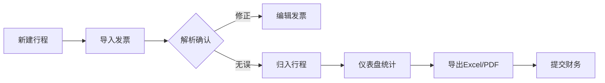
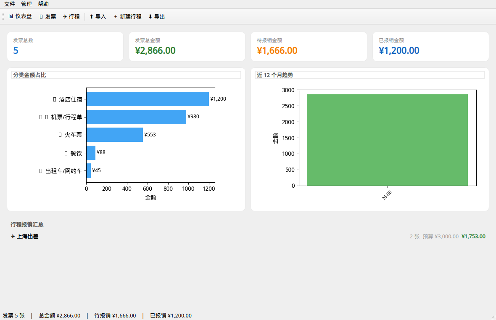
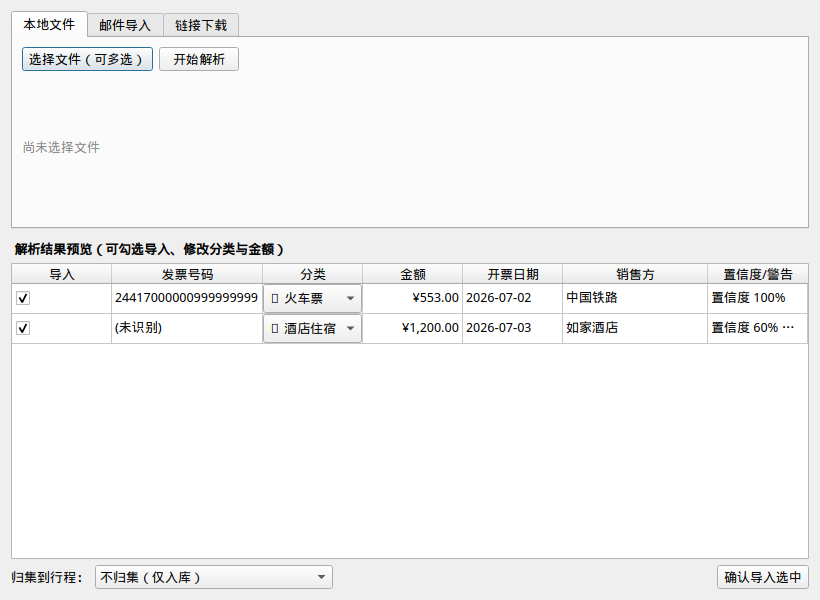
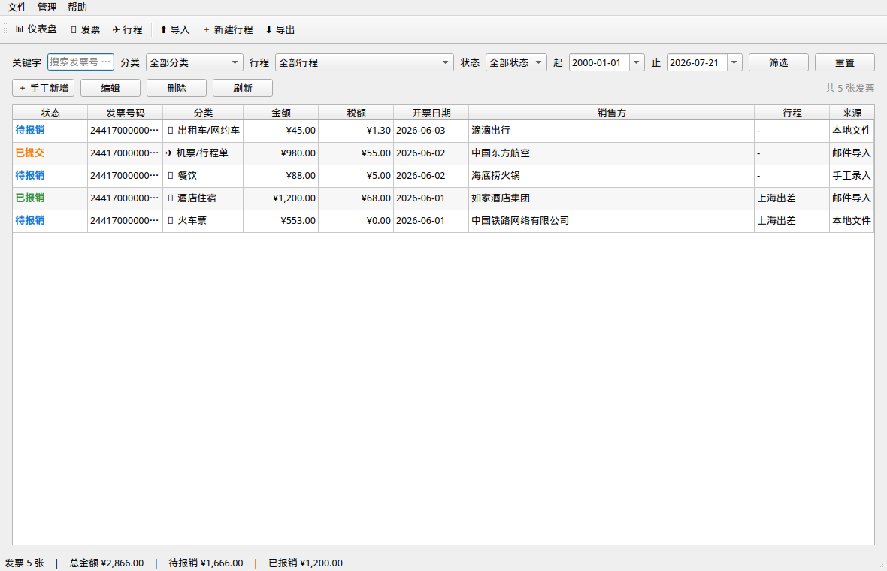
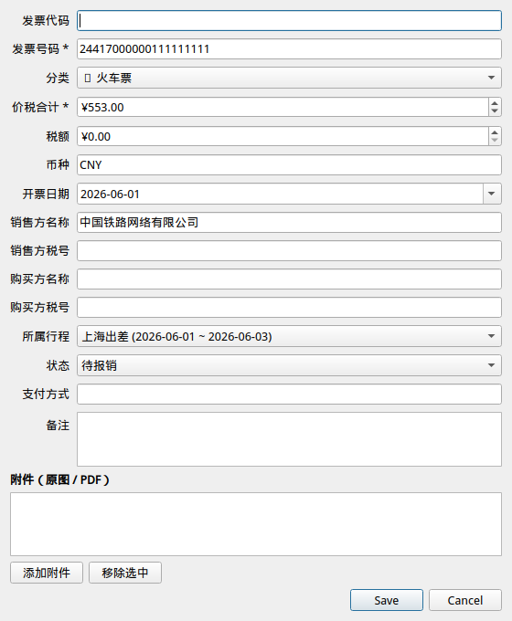
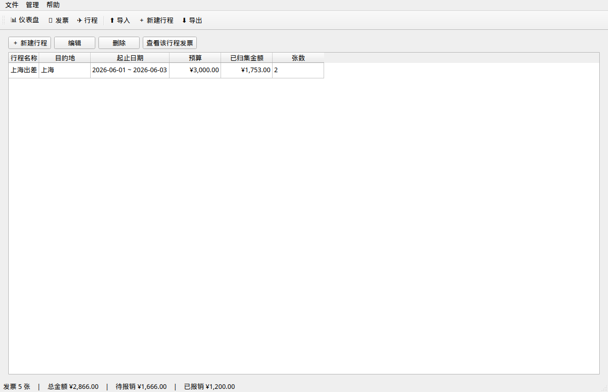
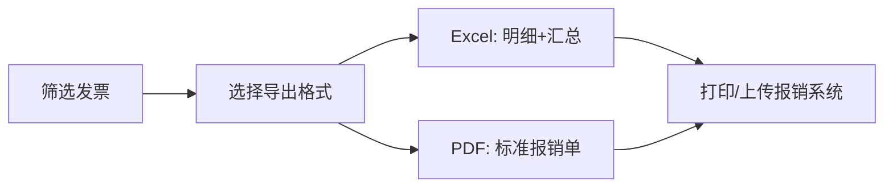
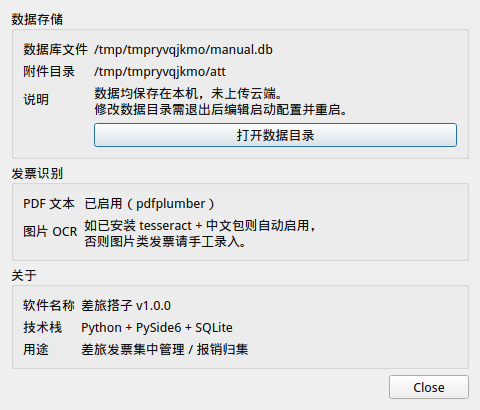

# 差旅搭子 · 操作手册

本手册带你从安装到完成一次报销归集，按步骤说明，配合界面截图使用。

---

## 一、快速开始

### 1.1 环境要求
- macOS / Windows / Linux
- Python 3.10 及以上
- （可选）tesseract + 中文语言包，用于图片类发票 OCR

### 1.2 启动软件

```bash
cd /Users/zhouyang/myworkspace/TravelBuddy/chailv_dazi
pip3 install -r requirements.txt
python3 main.py
```

首次运行会在你的用户目录下创建本地数据目录（默认 `~/.chailv_dazi/`），存放数据库 `invoices.db` 与发票附件 `attachments/`。

---

## 二、整体使用流程



| 步骤 | 对应主界面 | 核心动作 |
| --- | --- | --- |
| 1 | 行程页 | 新建出差行程 |
| 2 | 导入向导 | 本地 / 邮件 / 链接导入 |
| 3 | 导入预览 | 确认解析结果，修正分类金额 |
| 4 | 发票列表 | 按行程 / 分类 / 状态管理 |
| 5 | 仪表盘 | 查看总额、待报销、分类占比 |
| 6 | 文件菜单 | 导出 Excel 或 PDF |

---

## 三、主界面：仪表盘

启动后默认进入**仪表盘**，在这里一目了然看到所有发票的核心数据。



### 3.1 界面组成
- **顶部工具栏**：仪表盘 / 发票 / 行程 / 导入 / 新建行程 / 导出
- **统计卡片**：发票总数、发票总金额、待报销金额、已报销金额
- **分类金额占比**：各差旅分类（火车票、机票、酒店等）的金额条形图
- **近 12 个月趋势**：按月份的报销金额柱状图
- **行程报销汇总**：每个差旅行程已归集的发票金额与预算
- **状态栏**：底部实时显示汇总金额

---

## 四、导入发票

「导入发票」是软件的核心入口。点击工具栏 **「导入」** 或菜单 **文件 → 导入发票** 打开导入向导。



### 4.1 导入来源

导入向导提供三个来源页签：

| 页签 | 适用场景 | 操作步骤 |
| --- | --- | --- |
| **本地文件** | 电脑里已存的 PDF / 图片 / OFD 发票 | 点击「选择文件（可多选）」→ 选择发票 → 开始解析 |
| **邮件导入** | 邮箱里的发票附件（如 12306、携程、滴滴） | 填写 IMAP 服务器、邮箱、授权码 → 选择检索天数 → 拉取附件 |
| **链接下载** | 微信 / 钉钉 / 邮件里收到的发票链接 | 粘贴发票文件 URL → 解析链接 |

### 4.2 解析结果确认

解析完成后，下半部分会出现结果预览表：
- **导入**：勾选需要导入的发票
- **分类**：可修改自动推荐的分类（火车、酒店、餐饮等）
- **金额、开票日期、销售方**：双击单元格可快速修改
- **置信度/警告**：高置信度为绿色；若显示警告，请检查字段是否缺失
- **归集到行程**：选择发票归属的差旅行程，或选择「不归集」

最后点击右下角 **确认导入选中** 即可入库。

> **提示**：PDF 电子发票解析效果最好；图片发票依赖 OCR，若系统未安装 tesseract 会提示手工录入；OFD 文件暂不支持文本抽取，会保留为附件。

---

## 五、发票列表与管理

点击工具栏 **「发票」** 进入发票列表，这是日常管理发票的主界面。



### 5.1 筛选与查找
- **关键字**：搜索发票号码、税号、销售方、备注
- **分类**：按发票类型过滤
- **行程**：按差旅行程过滤，或选择未归集
- **状态**：草稿 / 待报销 / 已提交 / 已报销 / 已驳回
- **起止日期**：按开票日期范围过滤
- **重置**：一键清空所有筛选条件

### 5.2 发票操作
- **双击行**：打开发票详情/编辑对话框
- **手工新增**：填写一张发票
- **编辑**：选中发票后修改
- **删除**：删除发票及关联附件（不可恢复，请谨慎）

---

## 六、发票编辑

双击发票行后打开**发票详情/编辑**对话框。



### 6.1 可编辑字段
- 发票代码、发票号码
- 分类（下拉选择）
- 价税合计金额、税额（不含税金额自动推导）
- 币种、开票日期
- 销售方名称与税号、购买方名称与税号
- 所属行程、状态
- 支付方式、备注

### 6.2 附件管理
- **添加附件**：追加 PDF、图片或 OFD 原图
- **移除选中**：删除当前附件文件
- **双击附件**：调用系统默认程序打开查看

> **状态说明**：当状态设为「已报销」后，金额字段会自动被保护，防止误改。如需修改，请先把状态改回其他状态。

---

## 七、行程管理

点击工具栏 **「行程」** 进入差旅行程管理页。



### 7.1 新建行程
点击 **＋ 新建行程**，填写：
- 行程名称（必填）
- 目的地
- 开始日期、结束日期
- 预算
- 备注

### 7.2 行程操作
- **编辑**：修改行程信息
- **删除**：删除行程，该行程下发票变为未归集，不会删除发票
- **查看该行程发票**：一键跳转到发票列表，并自动按该行程筛选

---

## 八、导出报销单

月底或报销前，点击菜单 **文件 → 导出 Excel 报销表** 或 **导出 PDF 报销单**。



| 格式 | 内容 | 适用场景 |
| --- | --- | --- |
| **Excel** | 两张工作表：「报销明细」+「汇总」 | 需要按行程/分类做二次统计、发给财务做表 |
| **PDF** | 标准报销单格式，含发票列表与合计 | 打印、上传报销系统、归档 |

导出文件会自动命名为 `差旅报销_YYYYMMDD.xlsx` 或 `差旅报销_YYYYMMDD.pdf`。

---

## 九、设置与数据

点击菜单 **管理 → 设置 / 关于** 打开设置对话框。



### 9.1 可查看信息
- **数据库文件位置**：默认 `~/.chailv_dazi/invoices.db`
- **附件目录位置**：默认 `~/.chailv_dazi/attachments/`
- **打开数据目录**：一键打开所在文件夹，方便备份
- **发票识别**：显示 PDF 解析与图片 OCR 的启用状态

### 9.2 数据备份与迁移
由于所有数据均保存在本地，你可以：
- 直接复制 `~/.chailv_dazi/` 整个目录到移动硬盘或另一台电脑
- 换电脑时把整个目录复制过去，重新安装软件即可恢复

---

## 十、常见问题

| 问题 | 原因 | 解决办法 |
| --- | --- | --- |
| 图片发票无法自动识别文字 | 未安装 tesseract 或中文语言包 | 安装 `brew install tesseract` 和 `pip3 install pytesseract` |
| OFD 文件解析为空 | 暂不支持 OFD 文本抽取 | 保留附件，手工录入关键字段 |
| 邮件导入失败 | 邮箱密码/授权码或 IMAP 服务器填错 | 检查授权码（不是网页密码）和 IMAP 地址 |
| 发票金额被锁定无法编辑 | 状态为「已报销」 | 改回其他状态后再编辑 |
| 换电脑后数据丢失 | 只复制了代码，没复制数据目录 | 复制 `~/.chailv_dazi/` 到新机 |
| 导出 PDF 中文显示正常吗？ | 使用 reportlab 内置 CID 字体 | 正常，无需额外安装中文字体 |

---

## 附录：界面跳转速查

| 想做什么 | 入口 |
| --- | --- |
| 看整体数据 | 仪表盘 |
| 查/改单张发票 | 发票 → 双击 |
| 导入邮件里的发票 | 工具栏「导入」→ 邮件导入 |
| 按行程管理 | 行程 |
| 导出报销表 | 文件 → 导出 Excel / 导出 PDF |
| 看数据存在哪 | 管理 → 设置 / 关于 |
